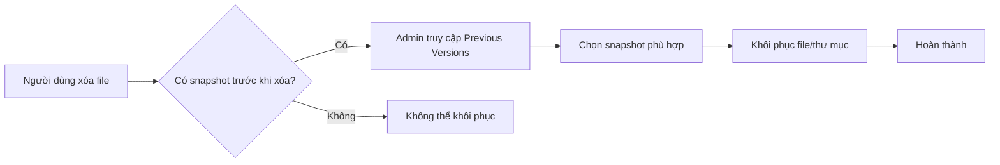

# Phần 1. Shadow Copy VSS là gì ?

>>>Tôi cần bạn phân tích chi tiết cách cấu hình Shadow Copy trong windows 10, 11 hoặc 2016/2019 / 2022/2025 server tính năng Shadow Copy?
>>>làm sao có thể cấu hình tính năng Shadow copy với các hành động xóa files hoặc xóa thư mục trong windows?
>>>đặc biệt các thư mục ShareFile Network NFS, SMB, NFC khi người dùng xóa files, hoặc
>>>folders có trong thư mục Network File Sharing thì chế độ Shadow copy sẽ giúp lưu các files/folders xóa đó vào 1 vùng thư mục do Shadow Copy lưu lại trên 1 thư mục logic của windows để Administrator account có quyền sẽ xem xét khôi phục nhưng files/folders bị xóa qua NFS, SMB nói trên?


Chào bạn, tôi sẽ phân tích chi tiết cách cấu hình Shadow Copy (Volume Shadow Copy Service - VSS) trên Windows 10/11 và Windows Server 2016-2025, đặc biệt tập trung vào khả năng khôi phục tệp/thư mục bị xóa từ các thư mục chia sẻ mạng (SMB/NFS).

# 📊 Phân Tích Chi Tiết Cấu Hình Shadow Copy Trên Windows

## 🔍 1. Tổng Quan Về Shadow Copy (VSS)

**Shadow Copy** là một công nghệ của Windows cho phép tạo các bản sao (snapshot) của volume tại một thời điểm nhất định mà không làm gián đoạn hoạt động của hệ thống. Khi tệp/thư mục bị xóa, các phiên bản trước đó vẫn còn trong snapshot và có thể được khôi phục.

**Cơ chế hoạt động**:
- Sử dụng kỹ thuật **Copy-on-Write**: Khi có thay đổi trên volume, dữ liệu gốc được lưu vào vùng lưu trữ shadow copy trước khi ghi dữ liệu mới.
- Snapshot không phải là bản sao đầy đủ, mà chỉ lưu trữ các thay đổi so với snapshot trước đó, giúp tiết kiệm không gian.

## 🛠️ 2. Cấu Hình Shadow Copy Trên Windows

### Bước 1: Kiểm Tra Điều Kiện Tiên Quyết
- **Hệ điều hành hỗ trợ**: Windows 10/11 (Pro/Enterprise), Windows Server 2016/2019/2022/2025.
- **Định dạng phân vùng**: Chỉ hỗ trợ **NTFS** (không hỗ trợ FAT32/exFAT).
- **Quyền truy cập**: Cần tài khoản **Administrator** để cấu hình.

### Bước 2: Cấu Hình Bằng Giao Diện Đồ Họa (GUI)

1.  Mở **Computer Management** (`compmgmt.msc`).
2.  Điều hướng đến **Shared Folders** → Right-click → **All Tasks** → **Configure Shadow Copies...**【[turn0search0](https://learn.microsoft.com/en-us/troubleshoot/windows-server/high-availability/shadow-copies-of-shared-folders)】【[turn0search1](https://learn.microsoft.com/nb-no/troubleshoot/windows-server/high-availability/shadow-copies-of-shared-folders)】【[turn0search2](https://learn.microsoft.com/vi-vn/troubleshoot/windows-server/high-availability/shadow-copies-of-shared-folders)】.
3.  Chọn volume muốn bật Shadow Copy (ví dụ: D:).
4.  Nhấn **Settings** để cấu hình:
    - **Located on this volume**: Chọn volume lưu trữ shadow copy (nên dùng volume riêng để tối ưu hiệu suất)【[turn0search0](https://learn.microsoft.com/en-us/troubleshoot/windows-server/high-availability/shadow-copies-of-shared-folders)】【[turn0search5](https://learn.microsoft.com/en-us/windows-server/storage/file-server/volume-shadow-copy-service)】.
    - **Maximum size**: Đặt giới hạn dung lượng (nếu không đặt sẽ dùng đến khi đầy volume).
5.  Nhấn **Enable** để bật tính năng.

### Bước 3: Cấu Hình Lịch Trình Snapshot
1.  Trong cửa sổ Shadow Copies, chọn volume → **Settings** → **Schedule**.
2.  Đặt lịch snapshot theo nhu cầu (mặc định 2 lần/ngày vào 7:00 và 12:00)【[turn0search3](https://learn.microsoft.com/en-us/answers/questions/2672249/how-to-schedule-regular-shadow-copies-under-window)】.
3.  Có thể tạo lịch tùy chỉnh (ví dụ: mỗi giờ vào giờ làm việc).

### Bước 4: Cấu Hình Bằng Dòng Lệnh (PowerShell/CMD)
Sử dụng lệnh `vssadmin` để quản lý:

```powershell
# Liệt kê các shadow copy hiện có
vssadmin list shadows

# Tạo shadow copy thủ công
vssadmin create shadow /for=D:

# Thay đổi dung lượng tối đa cho shadow copy (ví dụ: 50GB)
vssadmin resize shadowstorage /for=D: /on=D: /maxsize=50GB

# Xóa shadow copy cũ
vssadmin delete shadows /for=D: /oldest
```
【[turn0search5](https://learn.microsoft.com/en-us/windows-server/storage/file-server/volume-shadow-copy-service)】【[turn0search20](https://learn.microsoft.com/en-us/windows-server/administration/windows-commands/vssadmin-list-shadows)】【[turn0search21](https://learn.microsoft.com/en-us/windows-server/administration/windows-commands/vssadmin-delete-shadows)】

## 💾 3. Quản Lý Vùng Lưu Trữ Shadow Copy

### Vị Trí Lưu Trữ
- Shadow copy được lưu trong thư mục ẩn **System Volume Information** trên volume chứa snapshot.
- Có thể lưu trên volume khác để tối ưu hiệu suất (khuyến nghị)【[turn0search5](https://learn.microsoft.com/en-us/windows-server/storage/file-server/volume-shadow-copy-service)】【turn0search7】.

### Dung Lượng và Giới Hạn
- Theo mặc định, tối đa **64 shadow copy** cho mỗi volume【turn0search5】.
- Có thể tăng giới hạn này bằng registry key `MaxShadowCopies`【[turn0search5](https://learn.microsoft.com/en-us/windows-server/storage/file-server/volume-shadow-copy-service)】.
- Khi hết dung lượng, shadow copy cũ nhất sẽ bị xóa tự động.

## 🔄 4. Cách Shadow Copy Xử Lý Tệp/Thư Mục Bị Xóa

Khi người dùng xóa tệp/thư mục:
1.  Tệp/thư mục bị xóa khỏi hệ thống file hiện tại.
2.  **Tuy nhiên**, nếu có snapshot được tạo **trước khi** xóa, phiên bản của tệp/thư mục đó vẫn còn trong snapshot.
3.  Administrator có thể khôi phục từ snapshot đó.

### Quy trình khôi phục:


## 🌐 5. Cấu Hình Cho Thư Mục Chia Sẻ Mạng (SMB/NFS)

### Đối Với SMB (Windows File Sharing)
- Shadow Copy hoạt động tốt với SMB shares.
- Người dùng cuối có thể tự khôi phục bằng cách:
    1.  Right-click file/thư mục → **Properties** → **Previous Versions**.
    2.  Chọn phiên bản muốn khôi phục → **Restore** hoặc **Copy**【[turn0search10](https://docs.netapp.com/us-en/ontap/smb-admin/recover-files-folders-previous-versions-concept.html)】【[turn0search11](https://support.hpe.com/hpesc/public/docDisplay?docId=sd00002658en_us&page=GUID-46B3E599-C51D-4564-855E-F9BD1FD52064.html&docLocale=en_US)】【[turn0search13](https://docs.hitachivantara.com/r/en-us/nas-platform/15.3.x/mk-92hnas006/transferring-files-with-ftp/configuring-ftp-preferences)】【[turn0search14](https://docs.qnap.com/operating-system/qts/5.0.x/en-us/restoring-files-and-folders-using-windows-previous-versions-6BBDCCF2.html)】.

### Đối Với NFS
- **Shadow Copy không trực tiếp hỗ trợ NFS** vì NFS là giao thức của Unix/Linux.
- Giải pháp:
    1.  Cấu hình NFS share trên volume NTFS có bật Shadow Copy.
    2.  Sử dụng máy trạm Windows để truy cập qua SMB (nếu có thể) để khôi phục.
    3.  Sử dụng công cụ của bên thứ ba hỗ trợ VSS cho NFS.

### Lưu Ý Quan Trọng
- Shadow copy **không phải là recycle bin** - nó chỉ lưu snapshot theo lịch.
- Nếu tệp bị xóa **sau khi** snapshot gần nhất, nó sẽ không thể khôi phục.
- Cần đảm bảo lịch snapshot đủ thường xuyên (ví dụ: mỗi giờ) để giảm nguy cơ mất dữ liệu.

## 📋 6. So Sánh Phiên Bản Windows

| Tính năng | Windows 10/11 Pro | Windows Server 2016-2025 |
|-----------|-------------------|--------------------------|
| Hỗ trợ VSS | Có | Có |
| Giao diện cấu hình | Có | Có |
| Lịch trình tùy chỉnh | Có | Có |
| DiskShadow tool | Không | Có【[turn0search5](https://learn.microsoft.com/en-us/windows-server/storage/file-server/volume-shadow-copy-service)】 |
| Hỗ trợ cluster | Không | Có【[turn0search0](https://learn.microsoft.com/en-us/troubleshoot/windows-server/high-availability/shadow-copies-of-shared-folders)】【[turn0search1](https://learn.microsoft.com/nb-no/troubleshoot/windows-server/high-availability/shadow-copies-of-shared-folders)】 |
| Số lượng shadow copy tối đa | 64 (mặc định) | 64 (mặc định)【[turn0search5](https://learn.microsoft.com/en-us/windows-server/storage/file-server/volume-shadow-copy-service)】 |

## ⚙️ 7. Best Practices và Lưu Ý Quan Trọng

1.  **Sử dụng volume riêng cho shadow copy**: Nên dùng ổ đĩa vật lý riêng cho lưu trữ shadow copy để tối ưu hiệu suất【[turn0search0](https://learn.microsoft.com/en-us/troubleshoot/windows-server/high-availability/shadow-copies-of-shared-folders)】【[turn0search5](https://learn.microsoft.com/en-us/windows-server/storage/file-server/volume-shadow-copy-service)】.
2.  **Không sử dụng mount points**: Tránh tạo shadow copy trên mount points trong cluster【[turn0search0](https://learn.microsoft.com/en-us/troubleshoot/windows-server/high-availability/shadow-copies-of-shared-folders)】【[turn0search1](https://learn.microsoft.com/nb-no/troubleshoot/windows-server/high-availability/shadow-copies-of-shared-folders)】.
3.  **Giám sát dung lượng**: Thường xuyên kiểm tra dung lượng shadow copy để tránh đầy ổ đĩa.
4.  **Test khôi phục định kỳ**: Đảm bảo quy trình khôi phục hoạt động bằng cách test hàng tháng.
5.  **Kết hợp với backup**: Shadow copy không thay thế backup - nên dùng cùng với giải pháp backup đầy đủ.

> 💡 **Lưu ý quan trọng**: Khi thay đổi vị trí lưu trữ shadow copy, tất cả shadow copy cũ sẽ bị xóa【[turn0search6](https://learn.microsoft.com/en-us/answers/questions/1057002/move-vss-shadow-storage-location-in-windows-11)】.

## 🔧 8. Khắc Phục Sự Cố Thường Gặp

- **Lỗi 0x80070012**: Thường do vấn đề với VSS, thử restart service Volume Shadow Copy【[turn0search15](https://learn.microsoft.com/en-us/answers/questions/5642388/windows-server-backup-failed-issue)】.
- **Shadow copy không tạo được**: Kiểm tra dung lượng trống và dịch vụ VSS.
- **Không thấy Previous Versions**: Đảm bảo tệp/thư mục có trong snapshot và quyền truy cập hợp lệ.

## 📌 Kết Luận

Shadow Copy là công cụ hữu ích để bảo vệ dữ liệu trên các thư mục chia sẻ mạng. Để cấu hình hiệu quả:

1.  Bật Shadow Copy trên volume chứa dữ liệu chia sẻ.
2.  Sử dụng volume riêng để lưu trữ shadow copy.
3.  Đặt lịch snapshot phù hợp (ít nhất 2 lần/ngày).
4.  Hướng dẫn người dùng khôi phục qua Previous Versions (đối với SMB).
5.  Kết hợp với giải pháp backup định kỳ để bảo vệ toàn diện.

Đối với NFS, cần có giải pháp bổ sung vì Shadow Copy không hỗ trợ trực tiếp. Administrator nên cân nhắc sử dụng cả SMB và NFS cho cùng một dữ liệu nếu cần khả năng khôi phục từ Shadow Copy.

Nếu bạn cần hướng dẫn chi tiết cho bất kỳ bước cụ thể nào, đừng ngần ngại hỏi nhé!

---

# Phần 2. Cơ chế vận hành VSS Shadow Copy trên File Sharing Server của Windows?
>>> Nếu dùng VSS nói trên cho windows File Sharing Server 2019/2022 nhưng là VM có trên lớp ảo hóa VMware/ Hyper-V bên cạnh đó có dùng VBR v13 và VeeamONE và Veeam Agent support windows
>>> thì có bị ảnh hưởng gì ? và có thể cấu hình như thế nào?


Chào bạn, việc kết hợp VSS (Volume Shadow Copy Service) trên Windows File Server 2019/2022 chạy dưới ảo hóa (VMware/Hyper-V) cùng với hệ sinh thái Veeam (VBR v13, Veeam ONE, Veeam Agent) là một kịch bản phổ biến và mạnh mẽ, nhưng đòi hỏi cấu hình cẩn thận để tránh xung đột.

Dưới đây là phân tích chi tiết về các tác động, cách cấu hình và những điểm cần lưu ý.

---

## 📊 1. Tương Tác Giữa Các Thành Phần và VSS

### 🔧 VSS trên Windows File Server (VM Guest)
- **Chức năng**: Tạo các bản sao (snapshot) tại một thời điểm của volume để khôi phục file/thư mục bị xóa hoặc phiên bản cũ.
- **Yêu cầu**: Volume phải định dạng NTFS. VSS service cần chạy 【[turn0search5](https://helpcenter.veeam.com/docs/one/userguide/vms_to_monitor.html?ver=13)】【[turn0search11](https://community.veeam.com/discussion-boards-66/failed-to-create-vss-snapshot-10652)】.

### 🛡️ Veeam Backup & Replication (VBR) v13
- **Sử dụng VSS**: VBR tương tác với VSS ở hai cấp độ:
  1. **Host-level**: Dùng VSS của Hyper-V hoặc VMware VSS Provider để tạo snapshot của toàn bộ VM.
  2. **Guest-level**: Dùng VSS bên trong VM (Application-Aware Processing) để đảm bảo tính nhất quán của ứng dụng (SQL, Exchange, AD) 【[turn0search0](https://helpcenter.veeam.com/docs/vbr/userguide/ms_hyperv.html?ver=13)】【[turn0search2](https://helpcenter.veeam.com/docs/vbr/userguide/services_and_components.html?ver=13)】.
- **Nguy cơ xung đột**: Nếu VSS của Windows và VSS của Veeam cùng tạo snapshot cùng lúc, có thể gây lỗi hoặc snapshot hỏng.

### 📊 Veeam ONE
- **Vai trò**: Giám sát sức khỏe môi trường, bao gồm cả các job backup và trạng thái VSS. Nó không trực tiếp can thiệp vào VSS nhưng sẽ cảnh báo khi có lỗi 【[turn0search5](https://helpcenter.veeam.com/docs/agentforwindows/userguide/backup_hiw.html?ver=13)】【[turn0search9](https://forums.veeam.com/veeam-agent-for-windows-f33/windows-file-backup-without-snapshot-t89735.html)】.

### 💻 Veeam Agent for Windows
- **Sử dụng VSS**: Veeam Agent cũng dùng VSS để tạo snapshot khi backup file/thư mục hoặc toàn bộ hệ thống trên VM 【[turn0search10](https://helpcenter.veeam.com/docs/agentforwindows/userguide/backup_hiw.html?ver=13)】【[turn0search12](https://forums.veeam.com/veeam-agent-for-windows-f33/windows-file-backup-without-snapshot-t89735.html)】.
- **Lưu ý**: Nếu chạy Veeam Agent cùng lúc với VBR backup trên cùng một VM, có thể xung đột VSS.

---

## ⚠️ 2. Các Vấn Đề và Tác Động Tiềm Tàng

### 🔥 Xung Đột VSS
- **Đồng thời hóa snapshot**: Nếu VSS của Windows (cho Shadow Copies) và Veeam (cho backup) cùng chạy, có thể gây:
  - Lỗi `VSS_E_UNEXPECTED_PROVIDER_ERROR` 【[turn0search3](https://forums.veeam.com/vmware-vsphere-f24/problem-with-a-vm-migrated-from-hyper-v-t32154.html)】.
  - Snapshot bị hỏng, backup thất bại.
  - Shadow copies bị xóa đột ngột (Veeam dùng volatile shadow copies và xóa sau khi backup xong) 【[turn0search13](https://www.veeam.com/kb4231)】.

### 🧩 Tích Hợp Services Dư Thừa
- Nếu VM từng chạy trên Hyper-V rồi migrate sang VMware mà không gỡ Integration Services, có thể còn lại "Hyper-V IC Software Shadow Copy Provider", gây xung đột với VMware Tools VSS Provider 【[turn0search3](https://forums.veeam.com/vmware-vsphere-f24/problem-with-a-vm-migrated-from-hyper-v-t32154.html)】.

### 💾 Áp Lực Lưu Trữ
- Shadow copies của Windows và snapshot của Veeam đều tiêu tốn dung lượng ổ đĩa. Cần quản lý dung lượng cẩn thận để tránh đầy disk 【[turn0search11](https://community.veeam.com/discussion-boards-66/failed-to-create-vss-snapshot-10652)】【[turn0search20](https://forums.veeam.com/veeam-backup-replication-f2/shadow-copy-failure-what-fixed-it-t62293.html)】.

---

## 🛠️ 3. Hướng Dẫn Cấu Hình Tối Ưu

### 📋 Bước 1: Chuẩn Bị Môi Trường
1. **Kiểm tra và gỡ bỏ Integration Services dư thừa** (nếu migrate từ Hyper-V sang VMware):
   - Trong VM, mở Device Manager → View → Show hidden devices.
   - Tìm "Hyper-V IC Software Shadow Copy Provider" dưới "Storage VSS Providers" và gỡ bỏ nếu có 【[turn0search3](https://forums.veeam.com/vmware-vsphere-f24/problem-with-a-vm-migrated-from-hyper-v-t32154.html)】.
2. **Đảm bảo VMware Tools hoặc Hyper-V Integration Services được cài đặt và cập nhật**:
   - Chúng chứa VSS provider cần thiết cho backup nhất quán 【[turn0search1](https://forums.veeam.com/veeam-backup-replication-f2/can-vss-integration-components-be-rolled-back-t43035.html)】【[turn0search16](https://learn.microsoft.com/en-us/windows-server/virtualization/hyper-v/integration-services)】.

### 📋 Bước 2: Cấu Hình VSS trên Windows File Server
1. **Tách biệt lưu trữ Shadow Copy**:
   - Dùng một volume riêng (không phải volume chứa dữ liệu) để lưu shadow copies.
   - Mở `Computer Management` → `Shared Folders` → `All Tasks` → `Configure Shadow Copies` → `Settings` → chọn volume khác 【[turn0search0](https://helpcenter.veeam.com/docs/one/userguide/vms_to_monitor.html?ver=13)】【[turn0search5](https://community.veeam.com/discussion-boards-66/failed-to-create-vss-snapshot-10652)】.
2. **Giới hạn dung lượng**:
   - Đặt giới hạn tối đa cho shadow copy storage (ví dụ: 10-15% dung lượng volume) để tránh đầy disk.
   - Dùng lệnh:
     ```cmd
     vssadmin resize shadowstorage /for=D: /on=E: /maxsize=15GB
     ```
     【[turn0search5](https://helpcenter.veeam.com/docs/one/userguide/vms_to_monitor.html?ver=13)】【[turn0search11](https://community.veeam.com/discussion-boards-66/failed-to-create-vss-snapshot-10652)】.

### 📋 Bước 3: Cấu Hình Veeam Backup & Replication
1. **Tắt Application-Aware Processing nếu không cần**:
   - Trong job backup của VBR, vào `Guest Processing` → tắt `Enable application-aware processing` nếu không cần backup nhất quán ứng dụng.
   - Điều này giảm việc Veeam can thiệp vào VSS bên trong VM.
2. **Lên lịch phân biệt**:
   - Tránh giờ chạy job Veeam trùng với giờ tạo shadow copy của Windows.
   - Ví dụ: Shadow copy chạy mỗi 2 giờ vào giờ làm việc, job Veeam chạy vào ban đêm.

### 📋 Bước 4: Cấu Hình Veeam Agent (Nếu Dùng)
- **Tránh chạy đồng thời với VBR**:
  - Lên lịch cho Veeam Agent chạy vào thời điểm khác với job backup của VBR trên cùng VM.
- **Sử dụng chế độ backup phù hợp**:
  - Nếu chỉ cần backup file, có thể dùng mode "File level backup" thay vì "Entire computer" để giảm tác động.

### 📋 Bước 5: Giám Sát với Veeam ONE
- **Tạo báo cáo và alarm**:
  - Dùng Veeam ONE để giám sát:
    - Failed backup jobs.
    - VSS errors trong event log của VM.
    - Disk space alert.
  - Cấu hình alarm gửi email khi có lỗi VSS 【[turn0search5](https://helpcenter.veeam.com/docs/one/userguide/vms_to_monitor.html?ver=13)】【[turn0search9](https://www.veeam.com/products/veeam-data-platform/monitoring-observability-ai.html)】.

---

## 📌 4. Kịch Bản Gợi Ý và Lịch Trình Mẫu

Dưới đây là lịch trình mẫu để tránh xung đột:

| Thời Gian | Hoạt Động |
|-----------|-----------|
| **07:00** | Shadow copy của Windows (tạo 2 phiên bản/ngày) |
| **12:00** | Shadow copy của Windows |
| **22:00** | Job backup Veeam B&R (toàn bộ VM) |
| **23:00** | Job backup Veeam Agent (nếu có, chạy sau VBR) |

---

## 🧩 5. Troubleshooting Thường Gặp

### Lỗi: `Failed to create VSS snapshot`
- **Kiểm tra**:
  - Dung lượng trống trên volume 【[turn0search20](https://forums.veeam.com/veeam-backup-replication-f2/shadow-copy-failure-what-fixed-it-t62293.html)】.
  - Trạng thái VSS service: `vssadmin list writers` 【[turn0search21](https://community.veeam.com/blogs-and-podcasts-57/microsoft-vss-framework-recap-and-troubleshooting-8634)】【[turn0search22](https://forums.veeam.com/vmware-vsphere-f24/cannot-create-a-shadow-copy-of-the-volumes-containing-writer-t40564.html)】.
- **Khắc phục**:
  - Restart VSS service 【[turn0search14](https://community.veeam.com/discussion-boards-66/failed-to-create-vss-snapshot-10537)】.
  - Chạy `vssadmin delete shadows /for=<volume> /all` để xóa shadow copies hỏng.

### Lỗi: `VSS_E_UNEXPECTED_PROVIDER_ERROR`
- Thường do xung đột provider (Hyper-V vs VMware) 【[turn0search3](https://forums.veeam.com/vmware-vsphere-f24/problem-with-a-vm-migrated-from-hyper-v-t32154.html)】.
- **Giải pháp**: Gỡ bỏ provider dư thừa như đã hướng dẫn ở Bước 1.

---

## 💎 Kết Luận và Khuyến Nghị

1.  **Tách biệt lịch trình**: Không để VSS của Windows và Veeam chạy cùng lúc.
2.  **Dùng volume riêng cho shadow copy**: Giảm áp lực I/O và dung lượng.
3.  **Giám sát chặt chẽ**: Dùng Veeam ONE để theo dõi lỗi và sức khỏe hệ thống.
4.  **Test trước**: Thử nghiệm trong môi trường dev trước khi áp dụng production.

Bằng cách cấu hình đúng, bạn có thể tận dụng cả VSS của Windows để khôi phục file nhanh và Veeam để backup disaster recovery mà không gây xung đột. 
Nếu cần hỗ trợ sâu hơn về kịch bản cụ thể, hãy cung cấp thêm chi tiết về môi trường của bạn nhé!
