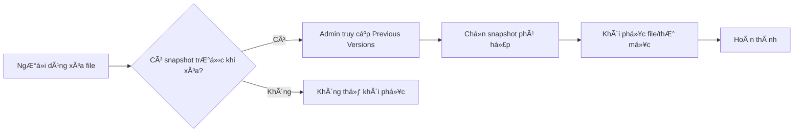

# Phần 1. Shadow Copy VSS là gì ?

>>>Tôi cần bạn phân tích chi tiết cách cấu hình Shadow Copy trong windows 10, 11 hoặc 2016/2019 / 2022/2025 server tính năng Shadow Copy?
>>>làm sao có thể cấu hình tính năng Shadow copy với các hành động xóa files hoặc xóa thư mục trong windows?
>>>đặc biệt các thÆ° mục ShareFile Network NFS, SMB, NFC khi ngÆ°á»i dùng xóa files, hoặc
>>>folders có trong thÆ° mục Network File Sharing thì chế Ä‘á»™ Shadow copy sẽ giúp lÆ°u các files/folders xóa đó vào 1 vùng thÆ° mục do Shadow Copy lÆ°u lại trên 1 thÆ° mục logic của windows để Administrator account có quyá»n sẽ xem xét khôi phục nhÆ°ng files/folders bị xóa qua NFS, SMB nói trên?


Chào bạn, tôi sẽ phân tích chi tiết cách cấu hình Shadow Copy (Volume Shadow Copy Service - VSS) trên Windows 10/11 và Windows Server 2016-2025, đặc biệt tập trung vào khả năng khôi phục tệp/thư mục bị xóa từ các thư mục chia sẻ mạng (SMB/NFS).

# 📊 Phân Tích Chi Tiết Cấu Hình Shadow Copy Trên Windows

## 🔠1. Tổng Quan VỠShadow Copy (VSS)

**Shadow Copy** là má»™t công nghệ của Windows cho phép tạo các bản sao (snapshot) của volume tại má»™t thá»i Ä‘iểm nhất định mà không làm gián Ä‘oạn hoạt Ä‘á»™ng của hệ thống. Khi tệp/thÆ° mục bị xóa, các phiên bản trÆ°á»›c đó vẫn còn trong snapshot và có thể được khôi phục.

**Cơ chế hoạt động**:
- Sử dụng kỹ thuật **Copy-on-Write**: Khi có thay đổi trên volume, dữ liệu gốc được lưu vào vùng lưu trữ shadow copy trước khi ghi dữ liệu mới.
- Snapshot không phải là bản sao đầy đủ, mà chỉ lưu trữ các thay đổi so với snapshot trước đó, giúp tiết kiệm không gian.

## ğŸ› ï¸ 2. Cấu Hình Shadow Copy Trên Windows

### BÆ°á»›c 1: Kiểm Tra Äiá»u Kiện Tiên Quyết
- **Hệ Ä‘iá»u hành há»— trợ**: Windows 10/11 (Pro/Enterprise), Windows Server 2016/2019/2022/2025.
- **Äịnh dạng phân vùng**: Chỉ há»— trợ **NTFS** (không há»— trợ FAT32/exFAT).
- **Quyá»n truy cập**: Cần tài khoản **Administrator** để cấu hình.

### BÆ°á»›c 2: Cấu Hình Bằng Giao Diện Äồ Há»a (GUI)

1.  Mở **Computer Management** (`compmgmt.msc`).
2.  Äiá»u hÆ°á»›ng đến **Shared Folders** → Right-click → **All Tasks** → **Configure Shadow Copies...**ã€[turn0search0](https://learn.microsoft.com/en-us/troubleshoot/windows-server/high-availability/shadow-copies-of-shared-folders)】ã€[turn0search1](https://learn.microsoft.com/nb-no/troubleshoot/windows-server/high-availability/shadow-copies-of-shared-folders)】ã€[turn0search2](https://learn.microsoft.com/vi-vn/troubleshoot/windows-server/high-availability/shadow-copies-of-shared-folders)】.
3.  Chá»n volume muốn bật Shadow Copy (ví dụ: D:).
4.  Nhấn **Settings** để cấu hình:
    - **Located on this volume**: Chá»n volume lÆ°u trữ shadow copy (nên dùng volume riêng để tối Æ°u hiệu suất)ã€[turn0search0](https://learn.microsoft.com/en-us/troubleshoot/windows-server/high-availability/shadow-copies-of-shared-folders)】ã€[turn0search5](https://learn.microsoft.com/en-us/windows-server/storage/file-server/volume-shadow-copy-service)】.
    - **Maximum size**: Äặt giá»›i hạn dung lượng (nếu không đặt sẽ dùng đến khi đầy volume).
5.  Nhấn **Enable** để bật tính năng.

### Bước 3: Cấu Hình Lịch Trình Snapshot
1.  Trong cá»­a sổ Shadow Copies, chá»n volume → **Settings** → **Schedule**.
2.  Äặt lịch snapshot theo nhu cầu (mặc định 2 lần/ngày vào 7:00 và 12:00)ã€[turn0search3](https://learn.microsoft.com/en-us/answers/questions/2672249/how-to-schedule-regular-shadow-copies-under-window)】.
3.  Có thể tạo lịch tùy chỉnh (ví dụ: mỗi giỠvào giỠlàm việc).

### Bước 4: Cấu Hình Bằng Dòng Lệnh (PowerShell/CMD)
Sử dụng lệnh `vssadmin` để quản lý:

```powershell
# Liệt kê các shadow copy hiện có
vssadmin list shadows

# Tạo shadow copy thủ công
vssadmin create shadow /for=D:

# Thay đổi dung lượng tối đa cho shadow copy (ví dụ: 50GB)
vssadmin resize shadowstorage /for=D: /on=D: /maxsize=50GB

# Xóa shadow copy cũ
vssadmin delete shadows /for=D: /oldest
```
ã€[turn0search5](https://learn.microsoft.com/en-us/windows-server/storage/file-server/volume-shadow-copy-service)】ã€[turn0search20](https://learn.microsoft.com/en-us/windows-server/administration/windows-commands/vssadmin-list-shadows)】ã€[turn0search21](https://learn.microsoft.com/en-us/windows-server/administration/windows-commands/vssadmin-delete-shadows)】

## 💾 3. Quản Lý Vùng Lưu Trữ Shadow Copy

### Vị Trí Lưu Trữ
- Shadow copy được lưu trong thư mục ẩn **System Volume Information** trên volume chứa snapshot.
- Có thể lÆ°u trên volume khác để tối Æ°u hiệu suất (khuyến nghị)ã€[turn0search5](https://learn.microsoft.com/en-us/windows-server/storage/file-server/volume-shadow-copy-service)】ã€turn0search7】.

### Dung Lượng và Giới Hạn
- Theo mặc định, tối Ä‘a **64 shadow copy** cho má»—i volumeã€turn0search5】.
- Có thể tăng giá»›i hạn này bằng registry key `MaxShadowCopies`ã€[turn0search5](https://learn.microsoft.com/en-us/windows-server/storage/file-server/volume-shadow-copy-service)】.
- Khi hết dung lượng, shadow copy cũ nhất sẽ bị xóa tự động.

## 🔄 4. Cách Shadow Copy Xử Lý Tệp/Thư Mục Bị Xóa

Khi ngÆ°á»i dùng xóa tệp/thÆ° mục:
1.  Tệp/thÆ° mục bị xóa khá»i hệ thống file hiện tại.
2.  **Tuy nhiên**, nếu có snapshot được tạo **trước khi** xóa, phiên bản của tệp/thư mục đó vẫn còn trong snapshot.
3.  Administrator có thể khôi phục từ snapshot đó.

### Quy trình khôi phục:


## 🌠5. Cấu Hình Cho Thư Mục Chia Sẻ Mạng (SMB/NFS)

### Äối Vá»›i SMB (Windows File Sharing)
- Shadow Copy hoạt động tốt với SMB shares.
- NgÆ°á»i dùng cuối có thể tá»± khôi phục bằng cách:
    1.  Right-click file/thư mục → **Properties** → **Previous Versions**.
    2.  Chá»n phiên bản muốn khôi phục → **Restore** hoặc **Copy**ã€[turn0search10](https://docs.netapp.com/us-en/ontap/smb-admin/recover-files-folders-previous-versions-concept.html)】ã€[turn0search11](https://support.hpe.com/hpesc/public/docDisplay?docId=sd00002658en_us&page=GUID-46B3E599-C51D-4564-855E-F9BD1FD52064.html&docLocale=en_US)】ã€[turn0search13](https://docs.hitachivantara.com/r/en-us/nas-platform/15.3.x/mk-92hnas006/transferring-files-with-ftp/configuring-ftp-preferences)】ã€[turn0search14](https://docs.qnap.com/operating-system/qts/5.0.x/en-us/restoring-files-and-folders-using-windows-previous-versions-6BBDCCF2.html)】.

### Äối Vá»›i NFS
- **Shadow Copy không trực tiếp hỗ trợ NFS** vì NFS là giao thức của Unix/Linux.
- Giải pháp:
    1.  Cấu hình NFS share trên volume NTFS có bật Shadow Copy.
    2.  Sử dụng máy trạm Windows để truy cập qua SMB (nếu có thể) để khôi phục.
    3.  Sử dụng công cụ của bên thứ ba hỗ trợ VSS cho NFS.

### LÆ°u à Quan Trá»ng
- Shadow copy **không phải là recycle bin** - nó chỉ lưu snapshot theo lịch.
- Nếu tệp bị xóa **sau khi** snapshot gần nhất, nó sẽ không thể khôi phục.
- Cần đảm bảo lịch snapshot đủ thÆ°á»ng xuyên (ví dụ: má»—i giá») để giảm nguy cÆ¡ mất dữ liệu.

## 📋 6. So Sánh Phiên Bản Windows

| Tính năng | Windows 10/11 Pro | Windows Server 2016-2025 |
|-----------|-------------------|--------------------------|
| Hỗ trợ VSS | Có | Có |
| Giao diện cấu hình | Có | Có |
| Lịch trình tùy chỉnh | Có | Có |
| DiskShadow tool | Không | Cóã€[turn0search5](https://learn.microsoft.com/en-us/windows-server/storage/file-server/volume-shadow-copy-service)】 |
| Há»— trợ cluster | Không | Cóã€[turn0search0](https://learn.microsoft.com/en-us/troubleshoot/windows-server/high-availability/shadow-copies-of-shared-folders)】ã€[turn0search1](https://learn.microsoft.com/nb-no/troubleshoot/windows-server/high-availability/shadow-copies-of-shared-folders)】 |
| Số lượng shadow copy tối Ä‘a | 64 (mặc định) | 64 (mặc định)ã€[turn0search5](https://learn.microsoft.com/en-us/windows-server/storage/file-server/volume-shadow-copy-service)】 |

## âš™ï¸ 7. Best Practices và LÆ°u à Quan Trá»ng

1.  **Sá»­ dụng volume riêng cho shadow copy**: Nên dùng ổ Ä‘Ä©a vật lý riêng cho lÆ°u trữ shadow copy để tối Æ°u hiệu suấtã€[turn0search0](https://learn.microsoft.com/en-us/troubleshoot/windows-server/high-availability/shadow-copies-of-shared-folders)】ã€[turn0search5](https://learn.microsoft.com/en-us/windows-server/storage/file-server/volume-shadow-copy-service)】.
2.  **Không sá»­ dụng mount points**: Tránh tạo shadow copy trên mount points trong clusterã€[turn0search0](https://learn.microsoft.com/en-us/troubleshoot/windows-server/high-availability/shadow-copies-of-shared-folders)】ã€[turn0search1](https://learn.microsoft.com/nb-no/troubleshoot/windows-server/high-availability/shadow-copies-of-shared-folders)】.
3.  **Giám sát dung lượng**: ThÆ°á»ng xuyên kiểm tra dung lượng shadow copy để tránh đầy ổ Ä‘Ä©a.
4.  **Test khôi phục định kỳ**: Äảm bảo quy trình khôi phục hoạt Ä‘á»™ng bằng cách test hàng tháng.
5.  **Kết hợp với backup**: Shadow copy không thay thế backup - nên dùng cùng với giải pháp backup đầy đủ.

> 💡 **LÆ°u ý quan trá»ng**: Khi thay đổi vị trí lÆ°u trữ shadow copy, tất cả shadow copy cÅ© sẽ bị xóaã€[turn0search6](https://learn.microsoft.com/en-us/answers/questions/1057002/move-vss-shadow-storage-location-in-windows-11)】.

## 🔧 8. Khắc Phục Sá»± Cố ThÆ°á»ng Gặp

- **Lá»—i 0x80070012**: ThÆ°á»ng do vấn Ä‘á» vá»›i VSS, thá»­ restart service Volume Shadow Copyã€[turn0search15](https://learn.microsoft.com/en-us/answers/questions/5642388/windows-server-backup-failed-issue)】.
- **Shadow copy không tạo được**: Kiểm tra dung lượng trống và dịch vụ VSS.
- **Không thấy Previous Versions**: Äảm bảo tệp/thÆ° mục có trong snapshot và quyá»n truy cập hợp lệ.

## 📌 Kết Luận

Shadow Copy là công cụ hữu ích để bảo vệ dữ liệu trên các thÆ° mục chia sẻ mạng. Äể cấu hình hiệu quả:

1.  Bật Shadow Copy trên volume chứa dữ liệu chia sẻ.
2.  Sử dụng volume riêng để lưu trữ shadow copy.
3.  Äặt lịch snapshot phù hợp (ít nhất 2 lần/ngày).
4.  HÆ°á»›ng dẫn ngÆ°á»i dùng khôi phục qua Previous Versions (đối vá»›i SMB).
5.  Kết hợp với giải pháp backup định kỳ để bảo vệ toàn diện.

Äối vá»›i NFS, cần có giải pháp bổ sung vì Shadow Copy không há»— trợ trá»±c tiếp. Administrator nên cân nhắc sá»­ dụng cả SMB và NFS cho cùng má»™t dữ liệu nếu cần khả năng khôi phục từ Shadow Copy.

Nếu bạn cần hÆ°á»›ng dẫn chi tiết cho bất kỳ bÆ°á»›c cụ thể nào, đừng ngần ngại há»i nhé!

---

# Phần 2. Cơ chế vận hành VSS Shadow Copy trên File Sharing Server của Windows?
>>> Nếu dùng VSS nói trên cho windows File Sharing Server 2019/2022 nhưng là VM có trên lớp ảo hóa VMware/ Hyper-V bên cạnh đó có dùng VBR v13 và VeeamONE và Veeam Agent support windows
>>> thì có bị ảnh hưởng gì ? và có thể cấu hình như thế nào?


Chào bạn, việc kết hợp VSS (Volume Shadow Copy Service) trên Windows File Server 2019/2022 chạy dÆ°á»›i ảo hóa (VMware/Hyper-V) cùng vá»›i hệ sinh thái Veeam (VBR v13, Veeam ONE, Veeam Agent) là má»™t kịch bản phổ biến và mạnh mẽ, nhÆ°ng đòi há»i cấu hình cẩn thận để tránh xung Ä‘á»™t.

Dưới đây là phân tích chi tiết vỠcác tác động, cách cấu hình và những điểm cần lưu ý.

---

## 📊 1. Tương Tác Giữa Các Thành Phần và VSS

### 🔧 VSS trên Windows File Server (VM Guest)
- **Chức năng**: Tạo các bản sao (snapshot) tại má»™t thá»i Ä‘iểm của volume để khôi phục file/thÆ° mục bị xóa hoặc phiên bản cÅ©.
- **Yêu cầu**: Volume phải định dạng NTFS. VSS service cần chạy ã€[turn0search5](https://helpcenter.veeam.com/docs/one/userguide/vms_to_monitor.html?ver=13)】ã€[turn0search11](https://community.veeam.com/discussion-boards-66/failed-to-create-vss-snapshot-10652)】.

### ğŸ›¡ï¸ Veeam Backup & Replication (VBR) v13
- **Sử dụng VSS**: VBR tương tác với VSS ở hai cấp độ:
  1. **Host-level**: Dùng VSS của Hyper-V hoặc VMware VSS Provider để tạo snapshot của toàn bộ VM.
  2. **Guest-level**: Dùng VSS bên trong VM (Application-Aware Processing) để đảm bảo tính nhất quán của ứng dụng (SQL, Exchange, AD) ã€[turn0search0](https://helpcenter.veeam.com/docs/vbr/userguide/ms_hyperv.html?ver=13)】ã€[turn0search2](https://helpcenter.veeam.com/docs/vbr/userguide/services_and_components.html?ver=13)】.
- **Nguy cÆ¡ xung Ä‘á»™t**: Nếu VSS của Windows và VSS của Veeam cùng tạo snapshot cùng lúc, có thể gây lá»—i hoặc snapshot há»ng.

### 📊 Veeam ONE
- **Vai trò**: Giám sát sức khá»e môi trÆ°á»ng, bao gồm cả các job backup và trạng thái VSS. Nó không trá»±c tiếp can thiệp vào VSS nhÆ°ng sẽ cảnh báo khi có lá»—i ã€[turn0search5](https://helpcenter.veeam.com/docs/agentforwindows/userguide/backup_hiw.html?ver=13)】ã€[turn0search9](https://forums.veeam.com/veeam-agent-for-windows-f33/windows-file-backup-without-snapshot-t89735.html)】.

### 💻 Veeam Agent for Windows
- **Sá»­ dụng VSS**: Veeam Agent cÅ©ng dùng VSS để tạo snapshot khi backup file/thÆ° mục hoặc toàn bá»™ hệ thống trên VM ã€[turn0search10](https://helpcenter.veeam.com/docs/agentforwindows/userguide/backup_hiw.html?ver=13)】ã€[turn0search12](https://forums.veeam.com/veeam-agent-for-windows-f33/windows-file-backup-without-snapshot-t89735.html)】.
- **Lưu ý**: Nếu chạy Veeam Agent cùng lúc với VBR backup trên cùng một VM, có thể xung đột VSS.

---

## âš ï¸ 2. Các Vấn Äá» và Tác Äá»™ng Tiá»m Tàng

### 🔥 Xung Äá»™t VSS
- **Äồng thá»i hóa snapshot**: Nếu VSS của Windows (cho Shadow Copies) và Veeam (cho backup) cùng chạy, có thể gây:
  - Lá»—i `VSS_E_UNEXPECTED_PROVIDER_ERROR` ã€[turn0search3](https://forums.veeam.com/vmware-vsphere-f24/problem-with-a-vm-migrated-from-hyper-v-t32154.html)】.
  - Snapshot bị há»ng, backup thất bại.
  - Shadow copies bị xóa Ä‘á»™t ngá»™t (Veeam dùng volatile shadow copies và xóa sau khi backup xong) ã€[turn0search13](https://www.veeam.com/kb4231)】.

### 🧩 Tích Hợp Services Dư Thừa
- Nếu VM từng chạy trên Hyper-V rồi migrate sang VMware mà không gỡ Integration Services, có thể còn lại "Hyper-V IC Software Shadow Copy Provider", gây xung Ä‘á»™t vá»›i VMware Tools VSS Provider ã€[turn0search3](https://forums.veeam.com/vmware-vsphere-f24/problem-with-a-vm-migrated-from-hyper-v-t32154.html)】.

### 💾 Ãp Lá»±c LÆ°u Trữ
- Shadow copies của Windows và snapshot của Veeam Ä‘á»u tiêu tốn dung lượng ổ Ä‘Ä©a. Cần quản lý dung lượng cẩn thận để tránh đầy disk ã€[turn0search11](https://community.veeam.com/discussion-boards-66/failed-to-create-vss-snapshot-10652)】ã€[turn0search20](https://forums.veeam.com/veeam-backup-replication-f2/shadow-copy-failure-what-fixed-it-t62293.html)】.

---

## ğŸ› ï¸ 3. HÆ°á»›ng Dẫn Cấu Hình Tối Ưu

### 📋 BÆ°á»›c 1: Chuẩn Bị Môi TrÆ°á»ng
1. **Kiểm tra và gỡ bỠIntegration Services dư thừa** (nếu migrate từ Hyper-V sang VMware):
   - Trong VM, mở Device Manager → View → Show hidden devices.
   - Tìm "Hyper-V IC Software Shadow Copy Provider" dÆ°á»›i "Storage VSS Providers" và gỡ bá» nếu có ã€[turn0search3](https://forums.veeam.com/vmware-vsphere-f24/problem-with-a-vm-migrated-from-hyper-v-t32154.html)】.
2. **Äảm bảo VMware Tools hoặc Hyper-V Integration Services được cài đặt và cập nhật**:
   - Chúng chứa VSS provider cần thiết cho backup nhất quán ã€[turn0search1](https://forums.veeam.com/veeam-backup-replication-f2/can-vss-integration-components-be-rolled-back-t43035.html)】ã€[turn0search16](https://learn.microsoft.com/en-us/windows-server/virtualization/hyper-v/integration-services)】.

### 📋 Bước 2: Cấu Hình VSS trên Windows File Server
1. **Tách biệt lưu trữ Shadow Copy**:
   - Dùng một volume riêng (không phải volume chứa dữ liệu) để lưu shadow copies.
   - Mở `Computer Management` → `Shared Folders` → `All Tasks` → `Configure Shadow Copies` → `Settings` → chá»n volume khác ã€[turn0search0](https://helpcenter.veeam.com/docs/one/userguide/vms_to_monitor.html?ver=13)】ã€[turn0search5](https://community.veeam.com/discussion-boards-66/failed-to-create-vss-snapshot-10652)】.
2. **Giới hạn dung lượng**:
   - Äặt giá»›i hạn tối Ä‘a cho shadow copy storage (ví dụ: 10-15% dung lượng volume) để tránh đầy disk.
   - Dùng lệnh:
     ```cmd
     vssadmin resize shadowstorage /for=D: /on=E: /maxsize=15GB
     ```
     ã€[turn0search5](https://helpcenter.veeam.com/docs/one/userguide/vms_to_monitor.html?ver=13)】ã€[turn0search11](https://community.veeam.com/discussion-boards-66/failed-to-create-vss-snapshot-10652)】.

### 📋 Bước 3: Cấu Hình Veeam Backup & Replication
1. **Tắt Application-Aware Processing nếu không cần**:
   - Trong job backup của VBR, vào `Guest Processing` → tắt `Enable application-aware processing` nếu không cần backup nhất quán ứng dụng.
   - Äiá»u này giảm việc Veeam can thiệp vào VSS bên trong VM.
2. **Lên lịch phân biệt**:
   - Tránh giỠchạy job Veeam trùng với giỠtạo shadow copy của Windows.
   - Ví dụ: Shadow copy chạy mỗi 2 giỠvào giỠlàm việc, job Veeam chạy vào ban đêm.

### 📋 Bước 4: Cấu Hình Veeam Agent (Nếu Dùng)
- **Tránh chạy đồng thá»i vá»›i VBR**:
  - Lên lịch cho Veeam Agent chạy vào thá»i Ä‘iểm khác vá»›i job backup của VBR trên cùng VM.
- **Sử dụng chế độ backup phù hợp**:
  - Nếu chỉ cần backup file, có thể dùng mode "File level backup" thay vì "Entire computer" để giảm tác động.

### 📋 Bước 5: Giám Sát với Veeam ONE
- **Tạo báo cáo và alarm**:
  - Dùng Veeam ONE để giám sát:
    - Failed backup jobs.
    - VSS errors trong event log của VM.
    - Disk space alert.
  - Cấu hình alarm gá»­i email khi có lá»—i VSS ã€[turn0search5](https://helpcenter.veeam.com/docs/one/userguide/vms_to_monitor.html?ver=13)】ã€[turn0search9](https://www.veeam.com/products/veeam-data-platform/monitoring-observability-ai.html)】.

---

## 📌 4. Kịch Bản Gợi à và Lịch Trình Mẫu

Dưới đây là lịch trình mẫu để tránh xung đột:

| Thá»i Gian | Hoạt Äá»™ng |
|-----------|-----------|
| **07:00** | Shadow copy của Windows (tạo 2 phiên bản/ngày) |
| **12:00** | Shadow copy của Windows |
| **22:00** | Job backup Veeam B&R (toàn bộ VM) |
| **23:00** | Job backup Veeam Agent (nếu có, chạy sau VBR) |

---

## 🧩 5. Troubleshooting ThÆ°á»ng Gặp

### Lá»—i: `Failed to create VSS snapshot`
- **Kiểm tra**:
  - Dung lượng trống trên volume ã€[turn0search20](https://forums.veeam.com/veeam-backup-replication-f2/shadow-copy-failure-what-fixed-it-t62293.html)】.
  - Trạng thái VSS service: `vssadmin list writers` ã€[turn0search21](https://community.veeam.com/blogs-and-podcasts-57/microsoft-vss-framework-recap-and-troubleshooting-8634)】ã€[turn0search22](https://forums.veeam.com/vmware-vsphere-f24/cannot-create-a-shadow-copy-of-the-volumes-containing-writer-t40564.html)】.
- **Khắc phục**:
  - Restart VSS service ã€[turn0search14](https://community.veeam.com/discussion-boards-66/failed-to-create-vss-snapshot-10537)】.
  - Chạy `vssadmin delete shadows /for=<volume> /all` để xóa shadow copies há»ng.

### Lá»—i: `VSS_E_UNEXPECTED_PROVIDER_ERROR`
- ThÆ°á»ng do xung Ä‘á»™t provider (Hyper-V vs VMware) ã€[turn0search3](https://forums.veeam.com/vmware-vsphere-f24/problem-with-a-vm-migrated-from-hyper-v-t32154.html)】.
- **Giải pháp**: Gỡ bỠprovider dư thừa như đã hướng dẫn ở Bước 1.

---

## 💠Kết Luận và Khuyến Nghị

1.  **Tách biệt lịch trình**: Không để VSS của Windows và Veeam chạy cùng lúc.
2.  **Dùng volume riêng cho shadow copy**: Giảm áp lực I/O và dung lượng.
3.  **Giám sát chặt chẽ**: Dùng Veeam ONE để theo dõi lá»—i và sức khá»e hệ thống.
4.  **Test trÆ°á»›c**: Thá»­ nghiệm trong môi trÆ°á»ng dev trÆ°á»›c khi áp dụng production.

Bằng cách cấu hình đúng, bạn có thể tận dụng cả VSS của Windows để khôi phục file nhanh và Veeam để backup disaster recovery mà không gây xung đột. 
Nếu cần há»— trợ sâu hÆ¡n vá» kịch bản cụ thể, hãy cung cấp thêm chi tiết vá» môi trÆ°á»ng của bạn nhé!
